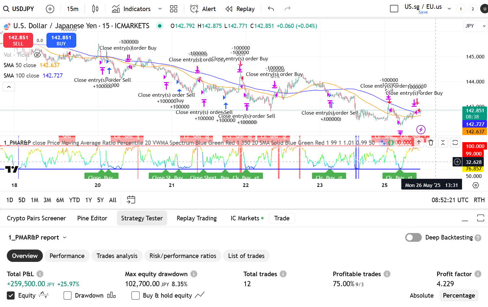
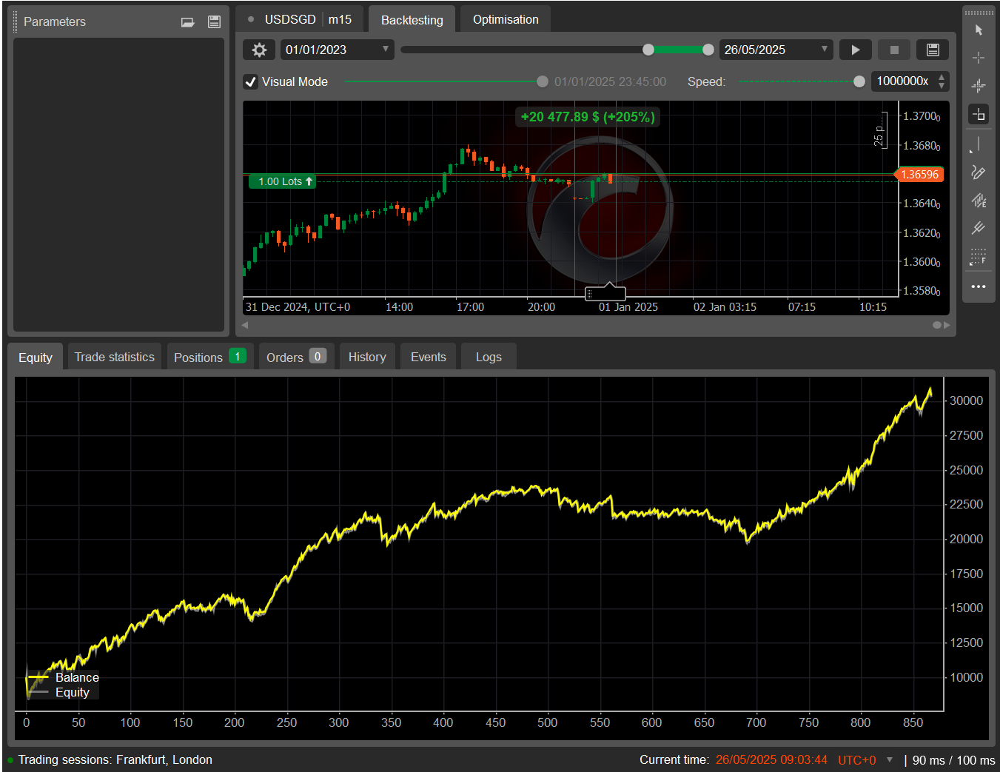
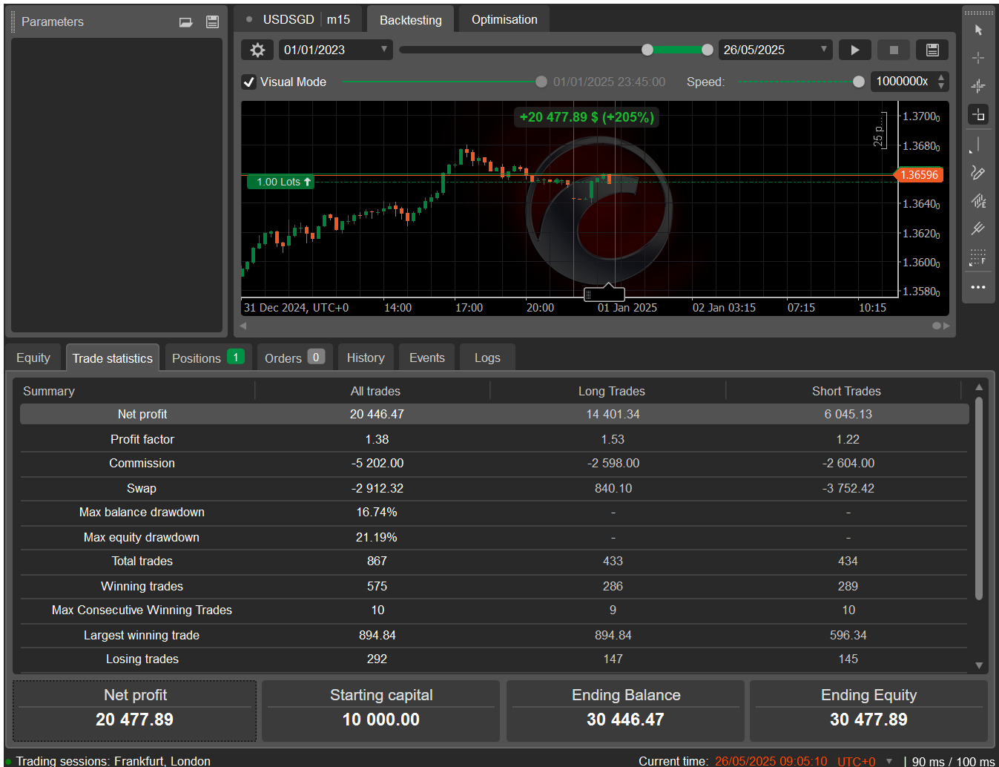

## 🧠 Project 1: Automating Live Trades via cTrader

### 📸 Screenshot Example of TradingView Algorithm 
(Algorithms on TradingView written in Pine Script we use C# for cTrader)


- As you can see we have decent **profit factor**





```python
!jupyter nbconvert ReadMe.ipynb --to markdown
```


```python

```
