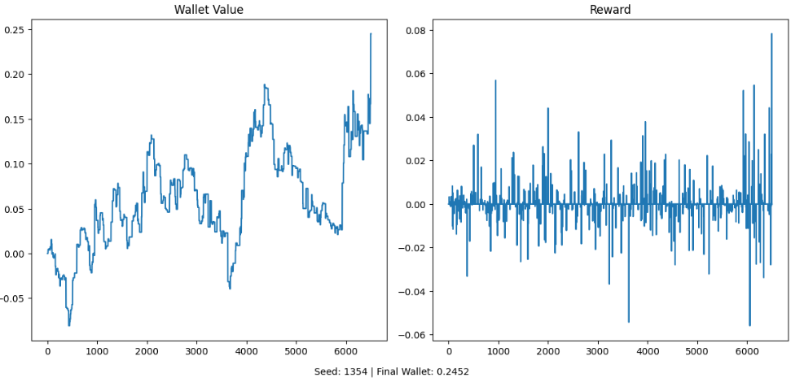

## 🧠 Project 2: Reinforcement Learning on IBKR Order Book

**Description:**  
Apply DQN to learn optimal trade actions based on order book (bid/ask) state snapshots from IBKR.

**Tech Stack:** Python, IB Gateway API, PyTorch, DQN, Numpy

**Key Outputs:**
- State representation of L2 order book
- Reward shaping with slippage penalty
- Epsilon decay, Q-visualization

📁 Files: `2_IBKR_TWS (Reinforcement Learning)/`

#### Result:



```python
!jupyter nbconvert ReadMe.ipynb --to markdown
```


```python

```
