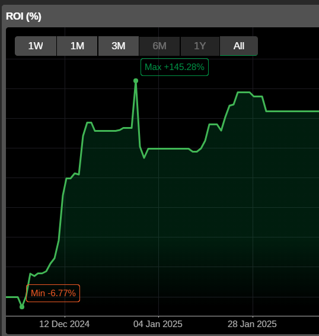
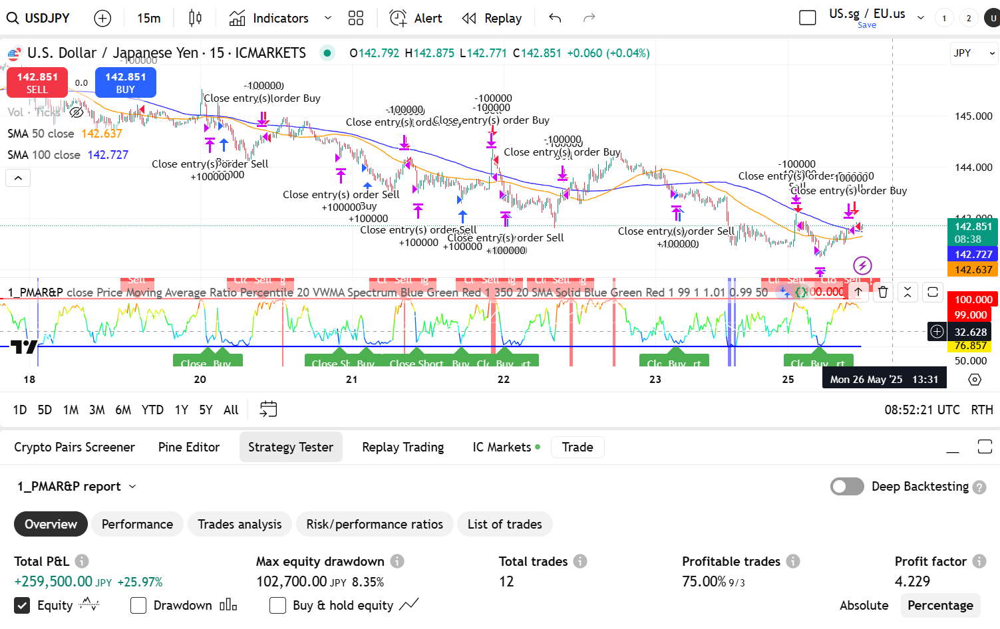
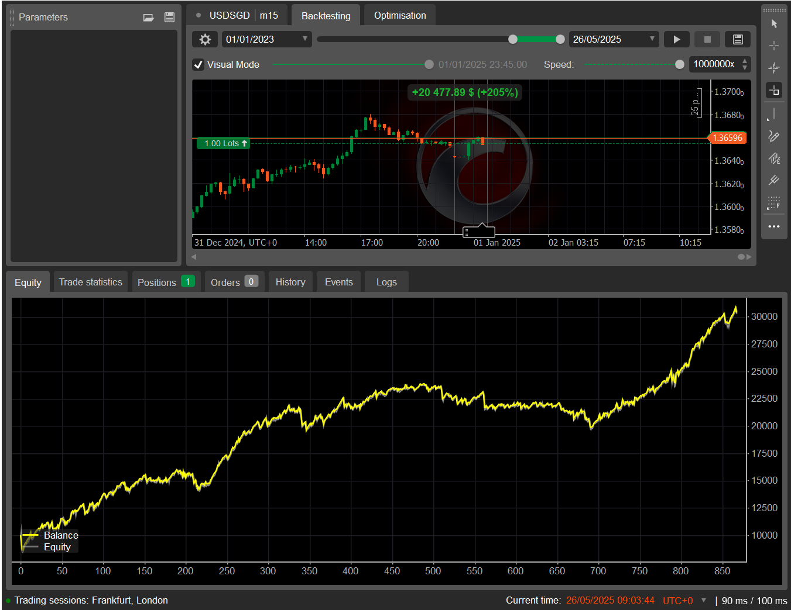
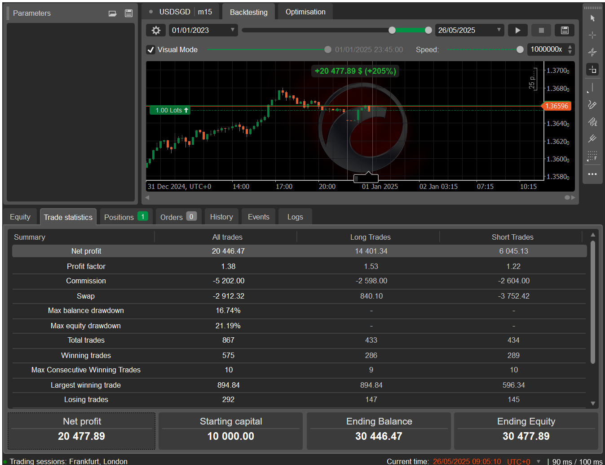
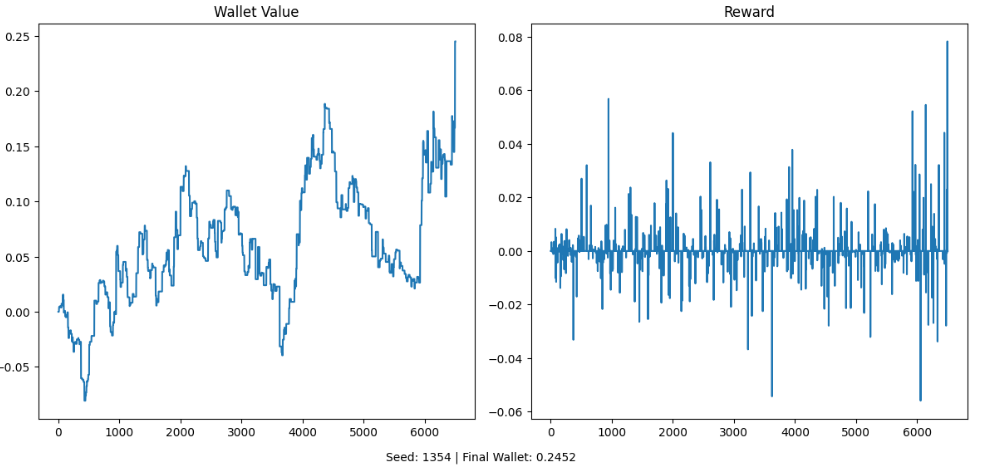
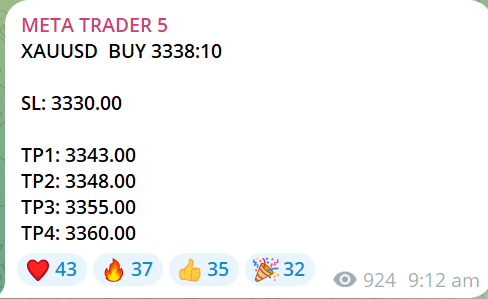
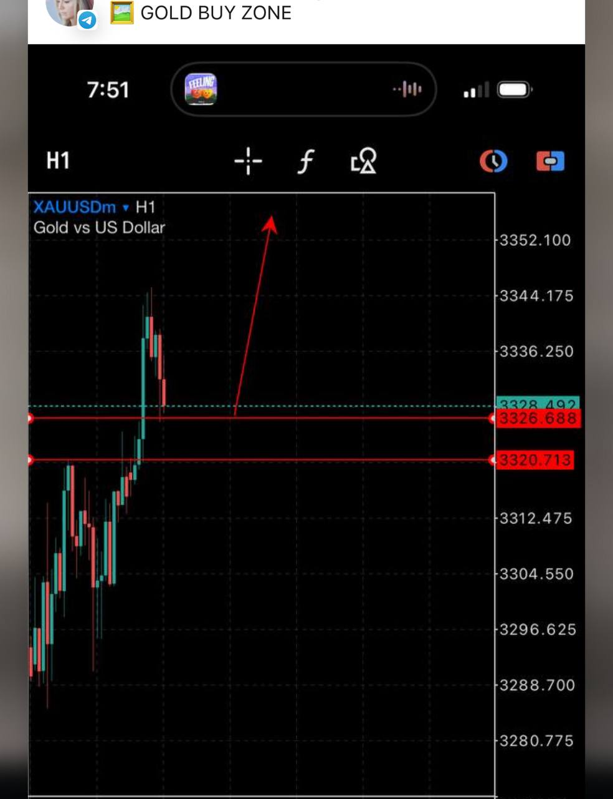
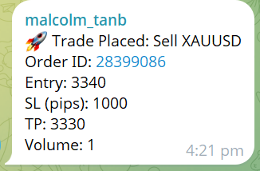

## 📚 Table of Contents

- [Project 1: cTrading Algorithms](https://github.com/malcolm1232/Algoss/tree/main/1_cTrader)
- 🔗 [My Live cTrader Portfolio (Click Me)](https://ct.spotware.com/investor/QlECLU8) (About 140% in 30 days)
  


- [Project 2: Reinforcement Learning on Order Book](https://github.com/malcolm1232/Algoss/tree/main/2_IBKR_TWS%20(Reinforcement%20Learning))
- [Project 3: AutomatedTradesFromScreenshot](https://github.com/malcolm1232/Algoss/tree/main/AutomatedTradesFromScreenshot)


# 📘 Project Portfolio: Quantitative Trading Systems

## Objective:
- Build, test, and automate trading strategies using:
  - Reinforcement Learning
  - Screenshot-to-trade automation
  - Order book analysis


### Some Open Source Algorithms on TradingView written in Pine Script and cTrader

## 📸 Screenshot Example of TradingView Algorithm 


- As you can see we have decent **profit factor**




## 🧠 Project 2: Reinforcement Learning on IBKR Order Book

**Description:**  
Apply DQN to learn optimal trade actions based on order book (bid/ask) state snapshots from IBKR.

**Tech Stack:** Python, IB Gateway API, PyTorch, DQN, Numpy

**Key Outputs:**
- State representation of L2 order book
- Reward shaping with slippage penalty
- Epsilon decay, Q-visualization

📁 Files: `2_IBKR_TWS (Reinforcement Learning)/`

#### Result:


## 🔁 Project 3: Automated Trades from Screenshot

**Description:**  
Use OCR and GPT to extract trade signals from a screenshot and send live orders to cTrader.

**Tech Stack:** Python, Pytesseract, OpenAI GPT, WebSockets, cTrader API

**Key Features:**
- Extracts SL/TP/Entry from image
- Converts to JSON and sends to execution bot
- Mirrored execution + logging to Telegram

📁 Files: `AutomatedTradesFromScreenshot/`, `Automated_Trades.ipynb`

## Example Image Input:


or 



## Example Output:
#### Place a Transaction and order confirmation sent to Telegram:


#### Copy (Professional) Full time Traders eg. from JPM, to leverage on their intellect to make it scalable.


```python
!jupyter nbconvert ReadMe.ipynb --to markdown
```
